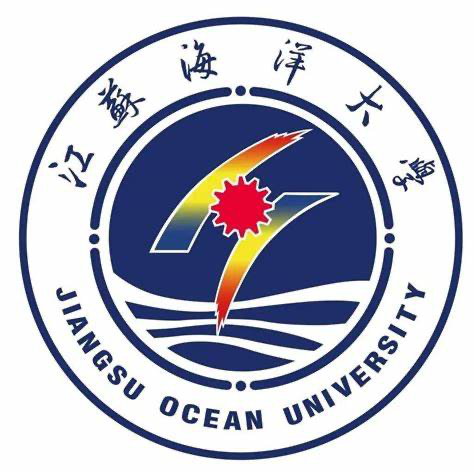
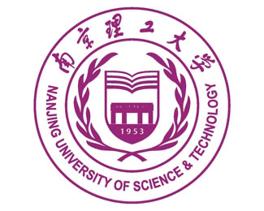

## Education

###  The Chinese University of Hong Kong [2022.09 - Present]
- Ph.D. in Mechanical and Automation Engineering
- Supervisor: [Prof. Ben M. Chen](https://www4.mae.cuhk.edu.hk/peoples/chen-benmei/)
- Selected Coursework:
  - Linear Systems Theory & Design (A/A)
  - Micromachining & MEMS (A-/A)
  - Design for Additive Manufacturing (A-/A)
  - Advanced Robotics (B+/A)

###  The Chinese University of Hong Kong [2020.09 - 2021.06]
- M.S. in Mechanical and Automation Engineering
- GPA: 3.675/4.000
- Supervisor: [Prof. Ben M. Chen](https://www4.mae.cuhk.edu.hk/peoples/chen-benmei/)
- Selected Coursework:
  - Control & Industrial Automation (A/A)
  - Machine Learning for Signal Processing (A/A)
  - Robotics (A-/A)
  - MEMS Technology & Applications (A-/A)

###  Jiangsu Ocean University [2016.09 - 2020.07]
- B.Eng. in Mechanical Design, Manufacturing and Automation
- GPA: 4.53/5.00 (Ranking: 3/204)

## Awards

- Chun Wo Innovation Student Awards 2022 ([Gold Award & Best Business Potential Award](https://www.cwisa.com/en/index.html))
- YDC Dare To Change 2022-2023 ([Best Business Idea Award](https://daretochange.ydc.org.hk/en/showcase-urbannet.aspx))
- Professor Charles K. Ko Student Creativity Award ([Champion](https://www.orkts.cuhk.edu.hk/en/news-events/announcements/3735-event-highlight-professor-charles-k-kao-student-creativity-awards-pckksca-prize-presentation-ceremony-1-june-2023))
- 48th Geneva International Exhibition of Inventions ([Bronze Medal](https://ifia.com/the-48th-international-exhibition-of-inventions-in-geneva-was-held-with-success/))

## Academic Visits

###  Nanjing University of Science and Technology [2024.05]
- Visiting Student in Control Science and Engineering
- Supervisors: [Prof. Zhenbo Song](https://www.researchgate.net/profile/Song-Zhenbo) and [Prof. Jianfeng Lu](http://202.119.85.163/open/TutorInfo.aspx?dsbh=Xn3GKidYcoyr!Qa1YK4RAQ==&yxsh=4iVdgPyuKTE=&zydm=fY2NaWnaNpk=)

###  University of California, Berkeley [2023.09]
- Visiting Student in HiPeR Lab, Mechanical Engineering
- Supervisor: [Prof. Mark W. Mueller](https://me.berkeley.edu/people/mark-w-mueller/)

###  Pengcheng Laboratory [2023.07]
- International Symposium on Cooperative Autonomous Systems
- Chairpersons: [Prof. Ben M. Chen](https://www4.mae.cuhk.edu.hk/peoples/chen-benmei/), [Prof. Jie Chen](https://www.tongji.edu.cn/info/1136/21221.htm) and [Prof. Hugh Liu](https://www.flight.utias.utoronto.ca/fsc/index.php/team)

## Research Experience

### Academic Projects
- **Flight Systems and Control Lab** (2021.09 - 2022.06)  
  University of Toronto  
  Collaborator: [Prof. Hugh H.T. Liu](https://www.flight.utias.utoronto.ca/fsc/index.php/team)

## Professional Experience

### Research Positions
- **Research Assistant** (2021.07 - 2022.08)  
  Hong Kong Centre for Logistics Robotics &  
  The Chinese University of Hong Kong  
  *Focus: Unmanned system based computer vision tasks*

### Industry Experience
- **Mechanical Engineer** (2019.10 - 2019.11)  
  Luoyang YTO Group Corporation  
  *Focus: Agricultural machinery design and testing*

- **Mechanical Engineer** (2016.06 - 2016.08, 2017.06 - 2017.08)  
  Jinling Branch of Sinopec  
  *Focus: Equipment maintenance and optimization*

## Exchange & Visiting

- **Nanjing University of Science and Technology** (2024.05)  
  Visiting Student, Control Science and Engineering  
  School of Computer Science and Technology  
  Supervisors: Prof. Zhenbo Song and Prof. Jianfeng Lu

- **University of California, Berkeley** (2023.09)  
  Visiting Student, HiPeR Lab  
  Department of Mechanical Engineering  
  Supervisor: [Prof. Mark M. Mueller](https://me.berkeley.edu/people/mark-mueller/)

- **Pengcheng Laboratory** (2023.07)  
  International Symposium on Cooperative Autonomous Systems  
  Chairpersons: Prof. Ben M. Chen, Prof. Jie Chen and Prof. Hugh Liu

- **Nanjing Tech University** (2018.08 - 2019.07)  
  Exchange Student  
  Key Coursework:
  - Finite Element Analysis (94/100)
  - Design and Manufacture of Pressing Model (95/100)
  - Numerical Computation (92/100)
  - Principles of Microcontrollers (91/100)
  - Hydraulic and Pneumatic Transmission (89/100)
  - Numerical Control Technology (88/100)
  - Design of Mechanics (86/100)
  - Thermodynamics & Heat Transfer (85/100)
  - Fundamentals of Control Engineering (85/100)

## Awards & Honors

### International Awards
- Gold Award & Best Business Potential Award - Chun Wo Innovation Student Awards, Hong Kong, 2023
- Best Business Idea Award - Young Entrepreneurs Development Council, Hong Kong, 2023
- Champion - Professor Charles K. Ko Student Creativity Award, CUHK, Hong Kong, 2023
- Bronze Medal - 48th Geneva International Exhibition of Inventions, Switzerland, 2023

### Scholarships
- Postgraduate Scholarship, CUHK, Hong Kong, 2022-2026
- National Scholarship for Graduate Students, Ministry of Education of China, 2022, 2021
- First Class Annual Scholarship, Jiangsu Ocean University, 2016-2020
- First Class Annual Scholarship, Nanjing Tech University, 2018-2019

### Competition Awards
- Second Prize - China RoboWork 2019 Small Quadrotor Project, 2019
- Champion - 'Engineer Training Cup' Mechanical Manufacturing Competition (Solar Power Car Project), 2018
- First Prize in "Challenge Cup" Competition, Jiangsu Province, 2021

### Academic Honors
- Outstanding Graduate Award, Jiangnan University, 2023
- Outstanding Student Award, Jiangnan University, 2022, 2021
- Merit Student, Jiangsu Ocean University, 2018-2019
- Outstanding Student Union Cadre, Jiangsu Ocean University, 2017-2018
- Outstanding Student Union Member, Jiangsu Ocean University, 2016-2017

## Technical Skills

### Software & Programming
- **Robotics Development**: ROS, ROS2, Gazebo
- **Programming Languages**: C++, Python, MATLAB
- **Deep Learning**: PyTorch, Keras
- **Computer Vision**: OpenCV, PCL, Open3D, CloudCompare, MeshLab
- **Data Analysis**: NumPy, SciPy, Scikit-Learn, Pandas
- **Control Systems**: LabVIEW, Simulink, PLC

### CAD & Engineering
- **3D Modeling**: Creo, SolidWorks
- **2D Design**: AutoCAD
- **Analysis Tools**: ANSYS

### Development Tools
- **Operating Systems**: Linux, Windows
- **Version Control**: Git
- **Containerization**: Docker
