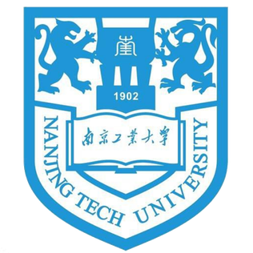

### Academic Experience
#####  The Chinese University of Hong Kong 
- Ph.D. in Mechanical and Automation Engineering
- Duration: 2022.09 - now 
- Supervisor: [Prof. Ben M. Chen](https://www4.mae.cuhk.edu.hk/peoples/chen-benmei/)

##### The Chinese University of Hong Kong  Hong Kong Centre for Logistics Robotics
- Research Assistant 
- Duration: 2021.07 - 2022.07
- Supervisor: [Prof. Ben M. Chen](https://www4.mae.cuhk.edu.hk/peoples/chen-benmei/)
- Centre Director: [Prof. Yunhui Liu](https://www4.mae.cuhk.edu.hk/peoples/liu-yun-hui/)

#####  The Chinese University of Hong Kong 
- M.S. in Mechanical and Automation Engineering
- Duration: 2020.09 - 2021.06
- Supervisor: [Prof. Ben M. Chen](https://www4.mae.cuhk.edu.hk/peoples/chen-benmei/)

#####  Nanjing Tech University
- Exchange Student in Mechanical Engineering
- Duration: 2018.09 - 2019.07
- Supervisor: [Prof. Haihan Xu](https://mech.njtech.edu.cn/info/1019/1836.htm)

#####  Jiangsu Ocean University 
- B.Eng. in Mechanical Design, Manufacturing and Automation
- Duration: 2016.09 - 2020.07
- Supervisor: [Prof. Yiqiang He](https://jixie.jou.edu.cn/info/1160/4857.htm) and [Prof. Dazhi Huang](https://coe.jou.edu.cn/info/1317/2211.htm)

### Academic Visiting
#####  University of California, Berkeley
- Visiting Student in HiPeR Lab under Mechanical Engineering
- Duration: 2025.05 - present / 2023.09 - 2023.10
- Supervisor: [Prof. Mark W. Mueller](https://me.berkeley.edu/people/mark-w-mueller/)

#####  Nanjing University of Science and Technology
- Visiting Student in Control Science and Engineering
- Duration: 2024.04 - 2025.05
- Supervisors: [Prof. Zhenbo Song](https://www.researchgate.net/profile/Song-Zhenbo) and [Prof. Jianfeng Lu](http://202.119.85.163/open/TutorInfo.aspx?dsbh=Xn3GKidYcoyr!Qa1YK4RAQ==&yxsh=4iVdgPyuKTE=&zydm=fY2NaWnaNpk=)

#####  Pengcheng Laboratory
- Visiting Student in International Symposium on Cooperative Autonomous Systems
- Duration: 2023.07 - 2023.07
- Chairpersons: [Prof. Ben M. Chen](https://www4.mae.cuhk.edu.hk/peoples/chen-benmei/), [Prof. Jie Chen](https://www.tongji.edu.cn/info/1136/21221.htm) and [Prof. Hugh Liu](https://www.flight.utias.utoronto.ca/fsc/index.php/team)

### Awards & Honors
##### Postgraduate
- [**Gold Award & Best Business Potential Award**](https://www.cwisa.com/en/index.html), Chun Wo Innovation Student Awards, Hong Kong, 2023
- [**Best Business Idea Award**](https://daretochange.ydc.org.hk/en/showcase-urbannet.aspx), YDC Dare To Change Business Pitch Competition, Hong Kong, 2023
- [**Champion**](https://www.orkts.cuhk.edu.hk/en/news-events/announcements/3735-event-highlight-professor-charles-k-kao-student-creativity-awards-pckksca-prize-presentation-ceremony-1-june-2023), Professor Charles K. Ko Student Creativity Award, Hong Kong, 2023
- [**Bronze Medal**](https://ifia.com/the-48th-international-exhibition-of-inventions-in-geneva-was-held-with-success/), 48th Geneva International Exhibition of Inventions, Geneva, 2023
- **Postgraduate Scholarship**, The Chinese University of Hong Kong, 2022-2026

##### Undergraduate
- **Outstanding Undergraduate**, Jiangsu Ocean University, 2020
- **First Class Annual Scholarship**, Jiangsu Ocean University, 2017; 2018; 2020
- **Competition-based Individual Scholarship**, Jiangsu Ocean University, 2019
- **Merit Student**, Jiangsu Ocean University, 2019
- **First Class Annual Scholarship**, Nanjing Tech University, 2019
- **Second Prize**, China RoboWork 2019 Small Quadrotor Project, Shaoguan, 2019
- **Champion**, Mechanical Manufacturing Competition Solar Power Car Project, Lianyungang, 2018

